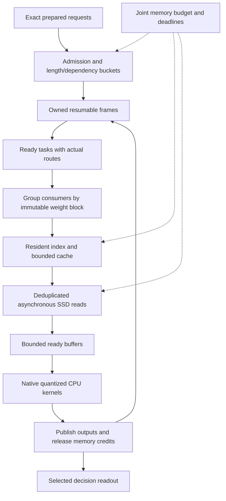

# CPU/SSD decision engine: component-level performance research

2026-09-26. Code inspection, analysis of existing traces, and primary-source research. No new inference benchmark, runtime change, model change, service-setting change, or upstream patch was made for this report.

The objective remains useful typed decisions on CPU, with a larger model on SSD and an **8 GiB execution-memory cap with no swap**. The optimization target is latency and useful decisions per second, including queueing, subject to correctness and memory constraints. Smaller files and fewer read bytes are intermediate metrics.

This extends the [earlier 48-component research](RESUMABLE-DECISION-ENGINE-RESEARCH.md) with **72 implementation-level components**, concrete source findings, industrial precedents, and experiments. It covers the experimental request-to-result path and its boundaries with the resident service and existing streamer; it does not claim a line-by-line audit of every vendored dependency. A candidate is not a measured improvement. Source mechanisms and our proposed adaptations are identified separately.

**Evidence and version boundary**

The committed base is `f120adcc3f8cc24f82613023d7eeb4bbaf3dcaec`. Current `native_bypass.h`, `run_bypass.py`, and related edits are a local follow-up, not part of that pushed commit. This audit reads both, distinguishing them below. [Static audit, source hashes, and trace-derived counts](research/resumable-performance-20260926/static-audit.json) identify the inspected source and evidence.

| Existing result | What it establishes | What it does not establish |
|---|---|---|
| Full → full-padded: 40.28 → 18.11 GB scoring reads; 58.75 → 41.68 seconds, three cold runs per mode | Batching reduced physical reads 55.0% and median scoring time 29.1% on the four-question fixture | File compression, tile-backend speed, or general workload performance |
| Lossless expert bundles | Matching gate/up/down portions can be independently addressed without requantization | Fewer required parameters or less arithmetic |
| Native staged tile executor | Exact layer output and selected-logit agreement on the tested fixtures, within the cap | A faster service: pushed check/replace still executes the original expert operations |
| Prefix serialization/restoration | Reproduced split-state behavior survives save/restore; non-flash diagnostic gives matching full/resumed logits | Faster shared-prefix execution or universally correct model answers |
| Local bypass | Original packed-layer expert operations can be skipped while preserving tested outputs | A stable backend API, all-layer integration, or demonstrated speedup |

Sources: [scheduling measurements](../results/resumable-20260925/comparison.json), [native results](RESUMABLE-NATIVE-TILES-RESULT.md), [bypass results](RESUMABLE-BYPASS-RESULT.md).

**New findings from the actual implementation**

1. **There is substantial per-bundle execution scaffolding.** For the saved eight-question geometry, current code implies 450 activation-graph constructions, 677 OpenMP parallel-region entries, and 21,430,272 calls through the native dot-kernel wrapper. These are source-derived counts, not measured CPU costs. OpenMP may reuse worker threads; a region entry does not mean a new OS thread. Different dot calls have different reduction lengths.
2. **Gate/up input quantization is duplicated.** `NativeTiles::evaluate()` creates two activation arrays. In the inspected GGML traits, Q4_K, Q5_K, and Q6_K all consume Q8_K activations. Sharing one conversion is a concrete candidate; determine equality by activation format/quantizer rather than just weight type. [Executor](../scripts/resumable/native_tiles.h), [local traits](../vendor/BigMoeOnEdge/third_party/llama.cpp/ggml/src/ggml-cpu/ggml-cpu.c).
3. **Reads are synchronous and already fairly large.** Each tested bundle is 884,736 bytes (864 KiB), with two bundles per expert. There is no overlap in this executor's `pread → compute → pread` loop. The strongest initial I/O question is whether known next-bundle reads can overlap computation; changing the syscall API alone is not enough.
4. **Layer zero is nearly a scan in the equalized batch.** It requests 252/256 experts (98.44%); the challenge requests 225/256 (87.89%). Across all 40 layers of the original full-padded trace, union coverage averages 75.52%, with 165–252 experts per layer. Do not generalize layer-zero saturation to every layer. A sparse-read versus coalesced-scan dispatcher deserves testing.
5. **The tiny fragmented groups are expensive consumers.** The original layer-zero groups contain 848, 38, and 22 rows. The latter two require 168 and 124 experts; their median route count per expert is one. Equalization raises average routed pairs per expert visit from 13.35 to 32.13, although it adds token positions. This is a scheduling/reuse effect.
6. **Tracing and execution control are coupled.** Supplying tile arguments enables the probe callback and route logging. The local bypass runner uses a fixed baseline-then-bypass order, one pair, with tracing on. Before performance attribution, separate essential bypass callbacks from JSON/tensor diagnostics and run balanced repetitions.
7. **The output head still computes the vocabulary projection.** The graph selects output token positions, then calls `build_lora_mm(model.output, ...)`; the probe subsequently retains only answer slots. Selecting token positions and selecting vocabulary rows are different optimizations. An option-row head is feasible in principle but needs explicit scale/adapter/tied-weight and API handling. [Model graph](../vendor/BigMoeOnEdge/third_party/llama.cpp/src/models/qwen35moe.cpp).
8. **The local admission ledger is not complete process accounting.** The executor has a conservative 256 MiB formula, but validation can also hold reference outputs, strided raw copies, vectors with spare capacity, graph metadata, and other caller allocations. Its `peak_accounted_work_bytes` must not be reported as total measured memory. The actual cgroup limit remains the enforcement mechanism.

**The useful cross-industry interpretation**

This engine resembles an external-memory query processor: requests are queries, weights are immutable indexed data, ready activation rows are operator inputs, and checkpoints are suspended query state. Database cooperative scans arrange for concurrent consumers to share data movement; Vectorwise's predictive buffer management used known scan progress to estimate future demand. Our adaptation can use already-routed ready work, but cannot pretend that future hidden-state-dependent expert routes are known. [Cooperative scans][S01], [industrial Vectorwise experience][S02].

The second relevant family is scientific computing: BLIS separates packing, cache-level blocking, and register kernels. Here the SSD bundle size, CPU cache panel size, and SIMD kernel shape should be independently selectable. Applying those ideas does not mean feeding K-quant bytes to a floating-point BLAS routine. [BLIS][S03], [GEMMFIP][S04].

**Hardware and optimization equations**

Read-only host inspection found an i7-8700K: six physical cores, twelve logical CPUs, AVX2/FMA, one NUMA node, 12 MiB shared L3. The workspace is on ext4 at `/dev/nvme0n1p5`. Verify the actual model/pack mount too when benchmarking. Do not assume NVMe marketing bandwidth, AVX-512, AMX, or multi-socket NUMA behavior.

The following are proposed cost models for this engine, not published performance predictions:

\[
\min T_{\mathrm{completion}}\quad\text{subject to}\quad
M_{\mathrm{charged}}\leq8\,\mathrm{GiB},\;M_{\mathrm{swap}}=0,\;\text{fidelity gate passes}.
\]

For a fixed execution schedule, a lower-bound sketch is

\[
T\geq\max(B_{SSD}/\beta_{SSD},\ B_{DRAM}/\beta_{DRAM},\ F/P,\ T_{dependency}).
\]

`B_DRAM` needs appropriate counters or a declared model; SSD bytes are not DRAM bytes. Quantized instruction costs make peak floating-point FLOPS a poor standalone predictor. Use measured kernel throughput plus Roofline/Top-Down analysis. [Berkeley Lab Roofline][S05], [Intel Top-Down][S06].

For a serial sequence of reads and independent compute, ideal double buffering changes the interior of the pipeline from a sum toward a maximum:

\[
T_{serial}=\sum_i(R_i+C_i),\qquad
T_{pipeline}\approx R_1+\sum_{i=1}^{n-1}\max(C_i,R_{i+1})+C_n.
\]

CPU contention, shared DRAM bandwidth, synchronization, queueing, and unequal stage times can defeat this approximation. Measure exposed wait on the request's critical path, not the sum of concurrent worker durations.

**A. Request preparation and admission — databases and service queueing**

Current code: [prepare.py](../scripts/resumable/prepare.py), [probe.cpp](../scripts/resumable/probe.cpp), [resident scorer](../resident/resident_scorer.py), [SemIf backend](../semif/src/semif_phase1/llamacpp_backend.py).

| ID / component and code anchor | Candidate and relevant field | Decision criterion / experiment |
|---|---|---|
| A1. Prompt rendering/tokenization — `prepare.main`, `encode_verified` | Cache immutable prepared tokens by exact content, tokenizer/template/model identity. Database prepared-plan analogue; implementation proposal. | Measure preparation fraction first. Cache lookup plus validation must cost less than rerender/tokenization; never normalize away semantically meaningful input. |
| A2. Exact result reuse — resident `call` boundary | Content-addressed memoization with execution contract in the key, plus [single-flight][S07] for concurrent identical requests. | Report exact-duplicate rate separately from engine speed. Near-equal text is not an exact cache hit. Account for batching-dependent numerics when defining the cached contract. |
| A3. Prefix discovery — `common_prefix` | Token radix tree over exact prefixes; keep immutable prefix identity separate from question schema. | Compare longest-prefix reuse against index/lookup overhead on many requests. Current fixture's linear prefix comparison is small; no need for a complex index yet. |
| A4. Answer-slot contract — `rows[].slots`, selected softmax | Deduplicate required vocabulary rows across questions, retaining each question's ordered slot mapping. Query projection analogue. | Preserve duplicates/tie-breaking/option order as specified; test different schemas. Multi-token labels require another scoring contract. |
| A5. Length equalization — `decode` padding | Cost-based bucketing: full-padded, similar-length buckets, or bounded waves. Database batch sizing and [vector execution][S08]. | Minimize estimated traversals plus padding compute and live state, not merely token count. Compare skewed lengths and near ties; do not reuse padded final state as an unpadded checkpoint. |
| A6. Admission delay — resident service boundary | Deadline-bounded batching with explicit input queue, inspired by [SEDA admission control][S09]. | Optimize completion latency including wait; sweep zero-wait through a declared maximum. Throughput improvement does not justify unbounded p95 delay. |
| A7. Dependent questions — orchestration boundary | A dependency DAG; batch only the current ready frontier. Scheduling precedence is standard in [job-shop optimization][S10]. | Use a fixture where one answer changes a later question. No independence inferred merely because fields share a JSON schema. |
| A8. Persistent engine lifetime — `ResidentScorer.__init__`, probe `main` | Reuse validated model/context and prepared plans across calls, while explicitly resetting request state. | Existing resident service already avoids repeated load. Integrate the experimental executor there only after backend gates; compare cold startup and steady requests separately. |

For A5, a useful candidate objective is `estimated sweep time + extra-token compute + checkpoint/copy time`, subject to live-memory capacity. It needs calibration against actual recurrent batch splitting. It is not a claim that padding always wins.

**B. Resumable state — virtual memory, compiler liveness, checkpointing**

Current code: [probe state modes](../scripts/resumable/probe.cpp), [tensor comparison](../scripts/resumable/compare_tensors.py), [native numerical diagnosis](RESUMABLE-NATIVE-TILES-RESULT.md).

| ID / component and code anchor | Candidate and relevant field | Decision criterion / experiment |
|---|---|---|
| B1. Prefix capture — `llama_state_seq_get_data` | Retain the existing exact serialized reference; describe checkpoint position, model/kernel ABI, and attention mode explicitly. | Compare uninterrupted, split, and split+restore at several positions. Measure capture/restore bytes and time separately. |
| B2. Full-attention sharing — independent restored sequences | Reference-count immutable KV pages; copy on write only when the representation requires mutation. OS [COW][S11] is a mechanism precedent. | Requires backend ownership support, not a `seq_cp` flag assumption. Count page-table/metadata overhead and prove branch isolation. |
| B3. Recurrent/convolution state — hybrid state snapshot | Share the immutable starting snapshot, allocate private mutable state for each active branch. | Recurrent state usually changes each step: page COW can end up copying nearly all of it. Compare explicit bounded copies; do not assume attention-page gains transfer. |
| B4. Serialization temporary — `saved` buffer | Pool bounded checkpoint buffers, release or reuse at the known last consumer. Compiler [liveness/ownership][S12]. | Reuse must not retain a large maximum buffer forever. Measure peak charged bytes and repeated-call latency. |
| B5. Checkpoint retention — no global policy in probe | Keep state according to avoided recomputation per byte, including the weight sweep it avoids. Cost-aware cache adaptation. | Estimate `expected reuse × avoided critical-path cost / retained bytes`; distinguish serialization size from allocated execution state. |
| B6. Resume granularity — prefix/suffix phase boundary | Compare full-prompt waves with segmented waves; eventually permit an explicit layer cursor and live tensors. | Fewer computed tokens can create more weight sweeps. Promote segmented execution only on total latency and correctness, not prefix-token savings alone. |
| B7. State spilling — not implemented | External-memory checkpoint/rematerialization choice with read+write+CPU cost and dependency constraints. [Scheduling formulation][S10], [liveness][S12]. | Spill only when total spill/reload is cheaper than recomputation and permits useful work. SSD is already serving weights; include interference. |
| B8. Attention consistency — `flash_attention` diagnostic | Fix or constrain the kernel path before broad resume scheduling. Maintain full/split/restored regression cases. | Current non-flash consistency is a controlled workaround, not a universal accuracy fix. A batch-size or attention change needs model-output and task-quality gates. |

Use explicit state objects rather than forking an already multithreaded inference process: Linux documents post-fork thread/lock restrictions. The useful borrowed idea is ownership and COW, not automatic process-per-question execution. [Linux fork semantics][S11].

**C. Scheduling ready computation — cooperative scans and operations research**

Current code: [`NativeTiles::evaluate`](../scripts/resumable/native_tiles.h), [`simulate.py`](../scripts/resumable/simulate.py), [`probe.cpp`](../scripts/resumable/probe.cpp).

| ID / component and code anchor | Candidate and relevant field | Decision criterion / experiment |
|---|---|---|
| C1. Route grouping — `vector<vector<int>> ready` | Histogram → exclusive prefix sum → stable scatter, yielding CSR-like expert offsets and one flat pair array. [Scan primitives][S13]. | O(NK+E), fewer small allocations; compare against current vectors at tiny and large groups. Preserve original pair indices. |
| C2. Expert execution order — numeric expert loop | Order ready experts by residency, then physical offset or measured finish cost, with aging. | Only reorder independent expert outputs. Do not reorder the downstream weighted reduction accidentally. Compare queue wait and reloads, not just sorting speed. |
| C3. Cross-call reuse — currently absent | Register suspended consumers at a common layer, then serve shared weights once: [cooperative scans][S01] adapted to ready activation rows. | State must fit before any read saving is real. A monolithic `llama_decode` callback cannot make other graphs' future activations ready. |
| C4. Future demand — simulator's offline knowledge | [Predictive buffer management][S02] using known ready tasks and conservative arrival estimates. | Distinguish known routes from predictions. Replay must withhold future IDs from an online policy until they would exist. |
| C5. Task descriptor — no global task ABI | Codelets with input/output handles, immutable weight IDs, work estimates, dependencies, and completion events. [StarPU][S14]. | Prototype a small CPU-only scheduler; adopting an entire heterogeneous runtime is optional. Measure task-dispatch overhead at actual task size. |
| C6. Priority/fairness — no deadline scheduler | Benefit-per-added-byte/time heuristic plus age/deadline term; enforce dependencies and memory credits. | Compare FIFO, locality-first, and deadline-aware schedules on mixed short/long questions. Declare weights and test starvation. |
| C7. Wave width — one bounded invocation | Admit more rows only while marginal avoided reads exceed extra compute, state retention, and queue cost. | Sweep branch count and byte budget jointly. Route saturation means larger batches may improve reuse while adding all-expert arithmetic. |
| C8. Schedule oracle — `simulate.py` frontier estimate | Small CP-SAT scheduling model with precedence, resources, memory intervals, read reuse, and state spill. [OR-Tools job shop][S10]. | Compare feasible heuristics against a declared offline bound. A trace oracle is neither an online scheduler nor a measured speed prediction. |

For a group G at layer l, compute its actual expert union `U_l(G)`. A useful payload metric is

\[
B_l(G)=\sum_{e\in U_l(G)} S_{l,e},\qquad
\Delta B=B_l(A)+B_l(B)-B_l(A\cup B).
\]

This assumes each expert's needed payload is read once and omits cache hits, alignment, readahead, and spill. Use measured physical bytes to validate it. Grouping can change floating-point execution and thus downstream routes; a replay of one schedule cannot prove route identity for another.

**D. SSD format — external-memory algorithms and storage engines**

Current code: [`tiles.py` packing/verification](../scripts/resumable/tiles.py), [`NativeTiles` manifest loading](../scripts/resumable/native_tiles.h).

| ID / component and code anchor | Candidate and relevant field | Decision criterion / experiment |
|---|---|---|
| D1. Address directory — `blocks[expert]` | Keep the existing resident direct index; optionally flatten fixed geometry into base+stride arithmetic. | Directory lookup is already O(1)-style indexing. Measure it before introducing learned indexes, B-trees, or extra SSD metadata reads. |
| D2. Format identity — manifest `model`, SHA | Immutable pack identity including content digest, format/kernel version, dimensions, quantizer and layout. Storage-engine versioned-format precedent [SQLite][S15]. | Current path-equivalence check does not establish content identity. Verify once when admitting a pack, not by rereading the model every request. |
| D3. Logical tile width — `slice_tile`, `tile=256` | Compare 256 versus 512 intermediate coordinates, preserving quantization boundaries and native arithmetic. | Existing layer has m=512, so these are the supported dividing widths. Measure read count, staging, graph overhead and equality; smaller is not automatically better. |
| D4. Physical read extent — bundle alignment | Allow one I/O extent to carry multiple independently described logical tiles. [ROMIO data sieving][S16]. | Decouple transfer size from compute tile size. At two contiguous tiles per expert, one read may replace two without extra payload, but needs a larger buffer. |
| D5. Gate/up/down layout — companion bundle | Compare current bundles with gate/up panels plus already row-contiguous down storage; explicit layout IDs. [Packing organization][S03]. | Staged reduction currently copies every down slice into full-row layout. Trade copy savings against extra seeks/reads; byte-identity verification remains mandatory. |
| D6. Co-access placement — numeric expert order | Trace-weighted, capacity-bounded hypergraph partitioning as an offline packing experiment. [KaHyPar][S17]. | Useful only if co-access predicts future requests and reduces physical cost after overfetch/cache effects. At near-full coverage a simple scan may win. |
| D7. Optional lossless compression | Independent bounded frames with optional shared dictionary; compare raw, LZ4-style fast coding, and Zstd. [Zstd format/API][S18]. | Quantized payload may compress poorly. Accept only when saved transfer time exceeds decode/copy time and memory cost; preserve random access. No lossy requantization in this track. |
| D8. Publication/integrity — pack builder | Build to temporary files, verify, then publish immutable manifest+payload generation; bounds checks and per-extent checksum if justified. [Storage atomicity precedent][S15]. | Protect long-running work from partial packs; integrity checks have CPU cost. Measure startup verification separately from hot-path consumption. |

For lossless compression, with raw bytes B, stored/raw ratio r, SSD bandwidth beta and decompression throughput D, a serial break-even sketch is

\[
(1-r)B/\beta > B/D + T_{extra\ copies}+T_{metadata}.
\]

For sparse reads versus a full-layer scan, compare `U*s/beta_sparse + n_sparse*L_sparse` with `E*s/beta_scan + n_scan*L_scan`, plus CPU and memory effects. Determine rates at the actual request sizes/queue depths; don't plug in vendor maxima. Fetching unused experts may be profitable, but **executing unused experts is not required**.

**E. Transport — operating systems and parallel scientific I/O**

Current code: [`NativeTiles::read`](../scripts/resumable/native_tiles.h), [existing file reader](../vendor/BigMoeOnEdge/core/src/io/file_reader.cpp), [existing expert streamer](../vendor/BigMoeOnEdge/core/src/moe/expert_stream_source.cpp). The latter already has I/O lanes/prefetch; it is a separate path, not functionality already integrated into NativeTiles.

| ID / component and code anchor | Candidate and relevant field | Decision criterion / experiment |
|---|---|---|
| E1. Direct-I/O alignment — hardcoded 4096 | Query `STATX_DIOALIGN` where supported, validate buffer/offset/length, retain a tested fallback. [Linux O_DIRECT][S19]. | 4 KiB works in recorded runs but is not a universal file contract. Do not silently label buffered fallback as direct I/O. |
| E2. Read correctness — single `pread` | Handle EINTR and short reads with alignment-aware completion logic; bounds-check file extents. | Do not blindly retry an unaligned residual direct read. Fail safely if completion cannot satisfy the descriptor; test injected short/error responses. |
| E3. Same-block in-flight reads — absent in prototype | One promise/future per immutable block ID; join waiters until completion. [Single-flight][S07]. | Avoid duplicate I/O when a global scheduler exists. Current serial within-group code already avoids this duplication; don't add synchronization without consumers. |
| E4. Read coalescing — one bundle/read | Sort known extents, merge adjacent ranges or bounded gaps. [ROMIO][S16]. | Merge a gap g only when extra transfer g/beta is cheaper than effective saved request overhead; include deadline and buffer costs. |
| E5. Read/compute overlap — synchronous loop | Two or a few bounded buffers; prefetch the next **already known** bundle while computing current work. [StarPU transfer scheduling][S14]. | Track producer/consumer ownership, stall intervals, and cancellation. Start with one worker; prediction is unnecessary for already-routed experts. |
| E6. Submission API — `pread` | Compare threaded pread against batched `io_uring`, optionally registered buffers. [io_uring design][S20]. | Same extents, queue depth, cache state and compute workload. At 864 KiB/read, overlap may matter more than syscall count. No default busy polling. |
| E7. Queue depth — effectively one | Sweep 1/2/4/8 in a bounded pipeline, using Little's-law sizing as an initial estimate, not a guarantee. | Required in-flight bytes roughly beta × latency; reserve every buffer in the global budget. Choose the smallest depth meeting throughput without p95/CPU regression. |
| E8. Speculative prefetch — existing stream source | Keep actual-route reads ahead of speculative reads; admit prediction only on positive expected exposed-stall saving. | Count useful prefetches, wasted bytes, cache pollution and demand delay. Never use predicted routes to omit required computation. |

A speculative admission model is `p*saved_stall - wasted_transfer_cost - eviction_cost - demand_interference > 0`. Fit its terms from this machine's traces; a high route-prediction hit rate alone is insufficient.

**F. Memory and cache — database buffer pools and web caching**

Current code: [executor memory formula](../scripts/resumable/native_tiles.h), [LRU simulator](../scripts/resumable/simulate.py), [streamer cache-budget setter](../vendor/BigMoeOnEdge/core/src/moe/expert_stream_source.cpp).

| ID / component and code anchor | Candidate and relevant field | Decision criterion / experiment |
|---|---|---|
| F1. Scratch allocation — per-expert vectors | Reusable bounded arenas by lifetime, analogous to [PostgreSQL memory contexts][S21]. | Reuse capacity across experts/calls with a trim policy; include retained capacity in the cap. Count allocation time and bytes, not only allocator calls. |
| F2. Buffer lifetime/aliasing — hidden/gate/up/output | Last-use analysis and destination-passing outputs; [MLIR bufferization][S12]. | Reuse only disjoint lifetimes. Preserve inputs needed by both projections and down staging. Compare live high-water mark against current ledger. |
| F3. Working-set accounting — `work_limit` | Joint ledger for dense weights, original mmap pages, tile cache, contexts, state, copies, graph scratch, I/O and runtime reserve. [cgroup v2][S22]. | Sample `memory.current/stat/events`; validate at worst route concentration and maximum admitted geometry. Never equate local formula with RSS/cgroup measurement. |
| F4. Eviction baseline — streamer LRU | Replay byte-weighted LRU alongside low-mutation SIEVE/S3-FIFO family candidates. [SIEVE research][S23]. | Evaluate actual traces, metadata and CPU cost. Web-cache results are not an MoE guarantee; long scans can defeat LRU. |
| F5. Admission — cache everything policy | Frequency-based admission with an exploration window, using [Caffeine/TinyLFU][S24] as an industrial precedent. | Test repeated requests and changing schemas; frequency admission can reject one-time data whose current consumers still require it. |
| F6. Cost-aware retention | GreedyDual-Size-style aging and retrieval cost/size, or known-next-use policy when ready-work metadata exists. [GDS][S25], [PBM][S02]. | Use exposed miss latency, not nominal bytes alone. Compare simple policies before combining many heuristics. |
| F7. Pinning/backpressure — no cross-call pins | Pin blocks while consumers or I/O own them; reserve state/output credits before admitting tasks. [SEDA][S09]. | Avoid deadlock where all memory is pinned by tasks waiting for more buffers. Keep an emergency completion reserve and bounded admission. |
| F8. Paging and adaptive budgets | Rebalance cache versus live questions at safe boundaries; monitor memory/IO PSI; test huge pages only if TLB pressure is measured. [PSI][S26], [THP][S27]. | No blind mlock/huge-page toggle. Reclaim and compaction can worsen latency under 8 GiB. Use hysteresis to avoid budget oscillation. |

Compare the marginal latency saving per additional memory slice for weights, checkpoints, and batch width. Allocating another 256 MiB to an expert cache is harmful if it evicts state that would have prevented a whole weight traversal. Policy evaluation must include both objects and the scheduler.

**G. CPU kernels — numerical libraries and compiler optimization**

Current code: [`native_tiles.h`](../scripts/resumable/native_tiles.h), [GGML CPU traits](../vendor/BigMoeOnEdge/third_party/llama.cpp/ggml/src/ggml-cpu/ggml-cpu.c), [build script](../scripts/resumable/build.sh).

| ID / component and code anchor | Candidate and relevant field | Decision criterion / experiment |
|---|---|---|
| G1. Duplicate input conversion — `qx[2]`, `quant` | Common-subexpression elimination: one prepared activation buffer when activation type, converter and layout match. | All three supported local weight types consume Q8_K. Require identical prepared bytes and final outputs; retain two-buffer fallback for future formats. |
| G2. Millions of indirect dot calls — `dot` inside loops | Dispatch weight format once outside inner loops; consider specialized kernels, inlining/LTO where ABI/build permits. | Compiler reports and CPU profiles must show reduced dispatch/front-end cost. Indirect-call count is not proof it dominates. |
| G3. Repeated weight traversal across rows | AVX2 multi-row quantized microkernel: reuse decoded weight pieces across a small panel of input rows. [BLIS microkernels][S03], [LAPACK Level-3 rationale][S28]. | Preserve each output's reduction semantics; don't use float32 GEMM as an exact replacement. Sweep row-panel size at actual 1–196 consumers/expert. |
| G4. Activation graph setup — `activate` | Cache GGML activation graph/plan and bounded backing buffers by shape, or expose an equivalent reusable native operation. | Reuse native SwiGLU semantics. Replacing it with scalar exp already failed a downstream near-tie; no approximate activation in the exact track. |
| G5. Parallel-region overhead — repeated `omp parallel for` | Persistent compute team or coarser work regions; serial threshold for tiny groups. [BLIS threading][S29]. | Current challenge implies 677 region entries. Measure synchronization, scheduling and oversubscription; keep native GGML and OpenMP teams coordinated. |
| G6. Down staging — `full_down`, `full_hidden`, `qfull` | Reuse buffers; write hidden tiles directly to final offsets where legal; explore a full-width kernel-ready down layout. [Packing fusion][S04]. | Preserve full native reduction and quantization. Partial tile summation is not presently an acceptable exact-path optimization. |
| G7. Affinity and thread count — default six | Joint sweep of compute threads, I/O workers, `OMP_PLACES=cores`, and binding policy. [OpenMP affinity][S30]. | Start near six physical cores, measure 1/2/4/6 and optionally SMT. Do not assume logical CPUs double throughput or dedicate scarce cores unnecessarily. |
| G8. Zeroing/copies — output initialization and strided gather | Destination-passing output, typed contiguous fast path plus correct strided fallback; eliminate initialization only where every element is provably written. [DuckDB views][S08], [MLIR][S12]. | Count copy bytes and validation copies separately. The original bypass failed when route IDs were assumed contiguous; stride correctness is mandatory. |

For G3, retaining the scalar output reduction order while vectorizing **across independent rows** is a promising first attempt. Reassociation inside a dot product, fast-math, or FMA changes can alter outputs. ReproBLAS demonstrates that reproducibility is a numerical algorithm concern; its reproducible result would not necessarily equal today's GGML reference. [ReproBLAS][S31].

**H. Graph integration and remaining model work — compilers and query projection**

Current code: [local bypass](../scripts/resumable/native_bypass.h), [probe callback](../scripts/resumable/probe.cpp), [Qwen graph](../vendor/BigMoeOnEdge/third_party/llama.cpp/src/models/qwen35moe.cpp), [existing dense policy](../vendor/BigMoeOnEdge/core/src/moe/dense_weights.cpp).

| ID / component and code anchor | Candidate and relevant field | Decision criterion / experiment |
|---|---|---|
| H1. Execution seam — temporary `GGML_OP_NONE` | A versioned backend operation / graph rewrite with explicit buffer ownership and dependencies. Compiler pass rather than name-dependent interception. | Existing bypass is a useful proof. A maintained seam must reject unsupported scales/biases/layouts and pass repeated graph reuse without metadata leaks. |
| H2. Synchronization — four bypass callbacks | One supported fused expert operation or fewer explicit boundaries, retaining validated native internal arithmetic. | Count backend synchronizations and tensor transfers. Do not remove a boundary until input readiness and output visibility are proven. |
| H3. Output materialization — `result`, tensor_set | Write directly into caller-provided contiguous output when lifetime and backend contract allow. | Eliminate one full output copy without exposing uninitialized buffers. Keep temporary output for shadow validation. |
| H4. Router-weighted merge — downstream original graph | Keep original slot ordering and weighted reduction; later fuse only with equivalent semantics. | The tile executor returns unweighted expert outputs, not the final MoE result. Test duplicate IDs, top-k shapes, and weight ordering. |
| H5. Selected vocabulary rows — full output projection | Project only union of required answer rows, then remap per question. Query projection pushdown analogue. | Handles output scales, adapters, tied embeddings and optional logit transforms. Exact conditional option softmax needs no discarded-vocabulary denominator; full-vocabulary probabilities are a different contract. Profile head share first. |
| H6. Dense/shared weights and embeddings | Reserve hot dense/shared tensors; gather only needed embedding rows where supported; reuse existing streamer policy before duplicating it. | Measure dense rereads under pressure. Expert read reductions may simply expose attention/shared-expert/head costs. |
| H7. Attention/recurrent kernels | Profile separately with Top-Down analysis; shape-specific optimization subject to B8 correctness. | Do not optimize the expert path as though it were the whole model. Full-context attention and recurrent updates have different scaling and dependencies. |
| H8. Multi-layer/resident integration | Roll out one layer → representative recurrent/full-attention boundaries → all intended layers → resident service. | Track per-layer fidelity and total budget at each step. One-layer timing is not multiplied by 40 as a prediction; cache/interference change. |

**I. Verification and measurement — production observability and experimental design**

Current code: [trace callback](../scripts/resumable/probe.cpp), [guard](../scripts/tiered/run_guarded.py), [matrix runner](../scripts/resumable/run_matrix.py), [bypass runner](../scripts/resumable/run_bypass.py), [analysis](../scripts/resumable/analyze.py), [native tests](../scripts/resumable/native_tests.cpp).

| ID / component and code anchor | Candidate and relevant field | Decision criterion / experiment |
|---|---|---|
| I1. Event tracing — JSON graph callback | Separate control callbacks from diagnostics; optional bounded binary events with request/layer/expert/tile IDs. [Dapper observability][S32]. | Compare disabled versus enabled overhead; reject timings dominated by tensor capture, file writes or callback synchronization. |
| I2. Critical-path timing — aggregate `seconds` | Timestamp read submission/completion, runnable/waiting, conversion, activation, dot, and output publication. | Report interval unions and dependencies. `native_tiles.seconds` currently includes reading and setup, not only arithmetic. |
| I3. CPU/DRAM attribution | `perf`/available hardware counters with [Top-Down][S06] and measured kernel throughput. | Distinguish front-end, core, DRAM, cache and scheduling stalls. Check event availability/multiplexing; do not infer DRAM bytes from model size. |
| I4. I/O attribution — process `read_bytes` | Report demanded payload, direct-read returns, process physical reads, cgroup/device stats, and amplification separately. | Process bytes include mmap/readahead; tile counters differ. Guard verification establishes pre-load cold state; loading may warm pages before scoring. |
| I5. Memory verification — `memory.peak`/events | Sample file/anon/scratch growth and PSI, including repeated requests; enforce no swap. [cgroup][S22], [PSI][S26]. | Passing without OOM does not imply low reclaim cost. Prevent shared external cache ownership from masquerading as an 8 GiB-contained win. |
| I6. Trial design — matrix/bypass runners | Balanced alternating pairs, repeated trials, paired differences and uncertainty, warm/cold strata. | At least several pairs after correctness; add runs until precision supports the decision. Three historical medians are evidence for that fixture, not stable p95 estimates. |
| I7. Fidelity and task quality — `compare` | Byte identity → native layer equality → final selected logits → held-out labeled quality. Separate stages. | Validate finite outputs, unique IDs, matching option/logit lengths, tie behavior and near ties. Existing `zip` comparisons need explicit full-length checks for a stronger harness. |
| I8. Provenance/build/workload coverage | Record source/binary/model/pack hashes, CPU/kernel/filesystem, compiler/library flags, batch shapes and thread settings. | Include small/large/skewed batches, repeat requests, schema shifts, near ties, state reuse and cancellation. Verify linked GGML's ISA build too; probe flags alone don't describe native kernels. |

**A bounded design that combines the findings**

This is a proposed integration, not a claim that a global scheduler already exists:

Each frame needs an operation cursor, live activations/residuals, state handles, actual route IDs once computed, destination handles, and deadline. Each block needs immutable identity, address/length, quantization/layout contract, checksum policy and consumer count. I/O completion makes data ready; dependency completion makes computation ready. These are different events.

Begin with a single scheduling/control owner and a bounded I/O queue. The machine has six cores; a distributed-runtime scale of locks, workers, polling and queue infrastructure can consume the benefit. StarPU and database systems are design precedents, not required dependencies.

**Experiments in dependency order**

| Experiment | Components | Concrete change to investigate | Acceptance / stop rule |
|---|---|---|---|
| P0. Honest timing seam | I1–I8, H1–H2 | Disable diagnostic output independently of required bypass callbacks; phase timers, full provenance, balanced baseline/bypass trials | No speed claim until trace overhead and baseline order are controlled; cap/fidelity must pass |
| P1. Low-risk CPU housekeeping | G1, G4, G8, F1 | Share Q8_K conversion, reuse scratch/activation plan, remove only proven redundant copies | Exact outputs across all existing fixtures; lower measured conversion/setup/copy cost and no end-to-end regression |
| P2. Two-buffer transport | E1–E7 | One bounded I/O worker, known next tile, pread baseline; then compare io_uring | Exposed wait falls without displacing useful CPU work or exceeding charged memory; reject syscall-only wins |
| P3. Adaptive physical reads | D3–D5, E4 | One versus two tiles/read; sparse/coalesced versus full-layer fetch at known route density | Same executed experts and outputs; improved end-to-end latency including overfetch |
| P4. CPU panel kernel | C1, G2–G7 | Flat ready directory, workload thresholds, AVX2 multi-row dot, coordinated thread team | Kernel speed across route-count distribution; strict reduction/activation gate; no unsupported ISA dependency |
| P5. Maintained multi-layer seam | H1–H4, H8 | Explicit backend operation and progressive layer integration | No duplicate original work, no trace requirement, per-layer and final equality, repeated contexts, capped memory |
| P6. Adaptive ready waves | A5–A7, C2–C8, F3/F7 | Compare padded/bucketed/wave schedules, then bounded cross-call cooperative execution | Fewer critical-path reads without excessive live state, queueing, unfairness, or downstream route/quality regressions |
| P7. Prefix and cache policy | B1–B8, F4–F8 | Schedule-aware checkpoints and measured cache-policy replay/integration | Better complete-request latency than best full-prompt schedule; don't accept token-count-only improvement |
| P8. Selective output head | A4, H5–H7 | Compute only requested output rows if profiling shows material head cost | Selected logits/contract preserved; head latency benefit visible in full request |
| P9. Layout/compression specialization | D2/D6–D8 | Offline co-access layout, independent lossless compression and immutable verified packs | Only after access/compute shape stabilizes; decode/repack cost must not erase read savings |

P3 can precede P2 if synchronous read setup dominates. P8 can move earlier if the output head is material. P6's length bucketing can begin before a general scheduler; its cross-call part depends on the maintained execution seam. Priorities are based on source evidence and integration risk, not on an invented forecast of speedup.

For every promoted candidate, maintain unchanged-weight and experimental-numerics tracks separately. Reassociation, new nonlinear approximations, early exits, neuron pruning, different quantization, Engram/n-gram substitution, or a trained classification head change the computation contract. They may deserve separate research but are not necessary to test the mechanisms above.

**What this investigation supports**

The demonstrated 40.28 → 18.11 GB improvement is preserved as evidence for scheduling. The next concrete opportunities are transport/compute overlap, reducing executor scaffolding, and matching CPU kernels to groups of consumers. The largest architectural opportunity is cooperative execution under a joint state/weight budget. None requires using the desktop GPUs or asserting that a frozen model can be replaced by an SSD lookup table.

The current evidence does not quantify how much faster the complete engine will become. This report supplies code targets, industry mechanisms, decision equations, and experiments capable of establishing that benefit.

**Primary sources and their scope**

Links were consulted on 2026-09-26. These sources establish the original mechanisms; proposed application to this engine is our inference. No published speedup is transferred to this hardware/model. Documentation is cited for mechanisms, not as proof a package version is installed locally.

| Source | Original field / use case | Mechanism used here |
|---|---|---|
| [S01: Cooperative Scans, VLDB 2007][S01] | Analytical database scans | Coordinate consumers of shared storage blocks |
| [S02: Cooperative Scans to Predictive Buffer Management, VLDB 2012][S02] | Vectorwise industrial database | Use query progress in buffer management |
| [S03: BLIS framework paper][S03] | Numerical computing library | Separate packing, cache blocking and microkernels |
| [S04: GEMMFIP][S04] | BLIS matrix multiplication research | Fuse packing with useful computation |
| [S05: Berkeley Lab Roofline][S05] | Scientific performance engineering | Separate arithmetic and data-movement ceilings |
| [S06: Intel Top-Down analysis][S06] | CPU application profiling | Attribute pipeline bottlenecks |
| [S07: Go singleflight][S07] | Production concurrency library | Suppress concurrent duplicate work |
| [S08: DuckDB execution format][S08] | Analytical database engine | Vector batches, selection vectors, physical views |
| [S09: Adaptive Overload Control, USITS 2003][S09] | Web/email service evaluation | Explicit queues and bounded admission |
| [S10: OR-Tools job-shop scheduling][S10] | Operations research | Precedence and resource constraints |
| [S11: Linux fork manual][S11] | Operating-system process memory | COW semantics and multithreaded restrictions |
| [S12: MLIR bufferization][S12] | Compiler infrastructure | Destination passing, alias/lifetime-aware reuse |
| [S13: Blelloch prefix sums][S13] | Parallel algorithms | Flat grouping and offsets |
| [S14: StarPU features][S14] | Scientific task runtime | Dependency-aware scheduling and data movement |
| [S15: SQLite atomic commit][S15] | Embedded database | Verified publication and incomplete-write handling |
| [S16: ROMIO optimizations][S16] | Parallel scientific file I/O | Data sieving and collective buffering |
| [S17: KaHyPar][S17] | Hypergraph partitioning | Capacity-constrained co-access placement candidate |
| [S18: Zstd manual][S18] | Lossless storage/network compression | Bounded independent compression/decompression |
| [S19: Linux open/O_DIRECT manual][S19] | Kernel file I/O | Alignment constraints and direct-read semantics |
| [S20: io_uring design][S20] | Linux asynchronous I/O | Shared submission/completion queues |
| [S21: PostgreSQL memory contexts][S21] | Database executor allocation | Group allocation by lifetime |
| [S22: Linux cgroup v2][S22] | Resource control | Charged-memory accounting and enforcement |
| [S23: SIEVE, NSDI 2024][S23] | Web-cache research | Low-overhead eviction comparator |
| [S24: Caffeine design][S24] | Production Java cache | Windowed frequency admission |
| [S25: GreedyDual-Size][S25] | Web proxy caching | Retrieval-cost/size-aware retention |
| [S26: Linux PSI][S26] | System resource observability | Memory/I/O/CPU pressure stalls |
| [S27: Linux transparent huge pages][S27] | Virtual memory | TLB benefit versus allocation/compaction costs |
| [S28: LAPACK and Level-3 BLAS rationale][S28] | Scientific linear algebra | Reuse through multiple right-hand sides |
| [S29: BLIS multithreading][S29] | Numerical-library execution | Work partitioning/thread coordination |
| [S30: OpenMP affinity examples][S30] | Parallel programming standard | Core places and binding |
| [S31: ReproBLAS][S31] | Reproducible numerical computing | Treat summation behavior as a contract |
| [S32: Google Dapper][S32] | Production distributed tracing | Correlated events with controlled overhead |

[S01]: https://www.vldb.org/conf/2007/papers/research/p723-zukowski.pdf
[S02]: https://arxiv.org/abs/1208.4170
[S03]: https://www.cs.utexas.edu/users/flame/pubs/BLISTOMSrev2.pdf
[S04]: https://arxiv.org/abs/2302.08417
[S05]: https://amcr.lbl.gov/departments/computer-science-department/ppan/roofline-performance-model/
[S06]: https://www.intel.com/content/www/us/en/docs/vtune-profiler/cookbook/2024-0/top-down-microarchitecture-analysis-method.html
[S07]: https://pkg.go.dev/golang.org/x/sync/singleflight
[S08]: https://www.duckdb.org/docs/current/internals/vector
[S09]: https://www.usenix.org/legacy/publications/library/proceedings/usits03/tech/full_papers/welsh/welsh_html/index.html
[S10]: https://developers.google.com/optimization/scheduling/job_shop
[S11]: https://man7.org/linux/man-pages/man2/fork.2.html
[S12]: https://mlir.llvm.org/docs/Bufferization/
[S13]: https://www.cs.cmu.edu/~guyb/papers/Ble93.pdf
[S14]: https://starpu.gitlabpages.inria.fr/features.html
[S15]: https://www.sqlite.org/atomiccommit.html
[S16]: https://ftp.mcs.anl.gov/pub/romio/users-guide/node5.html
[S17]: https://kahypar.org/
[S18]: https://facebook.github.io/zstd/zstd_manual.html
[S19]: https://man7.org/linux/man-pages/man2/open.2.html
[S20]: https://kernel.dk/io_uring.pdf
[S21]: https://www.postgresql.org/docs/current/spi-memory.html
[S22]: https://docs.kernel.org/admin-guide/cgroup-v2.html
[S23]: https://www.usenix.org/conference/nsdi24/presentation/zhang-yazhuo
[S24]: https://github.com/ben-manes/caffeine/wiki/Design
[S25]: https://pages.cs.wisc.edu/~cao/papers/gd-size.html
[S26]: https://www.kernel.org/doc/html/latest/accounting/psi.html
[S27]: https://docs.kernel.org/admin-guide/mm/transhuge.html
[S28]: https://www.netlib.org/lapack/
[S29]: https://github.com/flame/blis/blob/master/docs/Multithreading.md
[S30]: https://www.openmp.org/wp-content/uploads/openmp-examples-5-2.pdf
[S31]: https://bebop.cs.berkeley.edu/reproblas/
[S32]: https://research.google/pubs/dapper-a-large-scale-distributed-systems-tracing-infrastructure/
