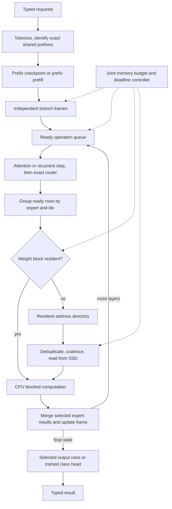

# Resumable decision inference from SSD: granular design and algorithm research

Research assessment, 2026-09-25. CPU-only; 8 GiB total execution-memory budget; SSD holds the larger model. No GPU substitution. This document maps the current software and proposes experiments; it does not implement or benchmark a new engine.

## 1. What we are optimizing

The target is a completed, useful typed decision, not generated tokens per second. The proposed engine retains routing metadata, intermediate computation, and useful weights in RAM; it retrieves addressable blocks from SSD and resumes the correct operation. Its central optimization is **useful decision work per weight transfer**.

There is no evidence-backed universally best algorithm for each component. Below, “candidate” means a strong method to compare with our existing implementation. Research results on GPU serving, training, databases, or another model are precedents, not speed predictions for this CPU. Cost formulas and proposed combinations are our design hypotheses unless explicitly attributed.

Three distinct research tracks must remain distinguishable:

1. **Same weights and model operations:** prefix reuse, legal scheduling, lossless packing, caching, selective output projection. Floating-point operation order can still change results.
2. **Prediction with exact fallback:** speculative prefetch chooses what to load early; the actual router still chooses what executes. Prediction errors cost resources, not intentional changes to model semantics.
3. **Different model computation:** trained classification heads, early exits, sparse-neuron predictors that omit work, quantization, Engram-like lookup modules. These require a separate task-quality evaluation; they cannot claim equivalence to the original model.

SemIf uses option-token logits from an existing language model. AlexWortega's OpenJEV trains a sequence classifier with a small NLI head. Both can avoid generation, but their numerical contracts and candidate evaluation costs differ. The latter also provides a shared-prefix hypothesis path. [SemIf source](https://github.com/TheoLeeCJ/SemIf-OpenJev/blob/master/src/semif_phase1/shared.py), [OpenJEV model and code](https://huggingface.co/AlexWortega/openjev/blob/main/modeling_openjev.py).

## 2. Actual software boundaries in this workspace

These are separate paths, not one already-integrated stack. Paths below are relative to the workspace root.

| Boundary | Current files | What exists / what is missing |
|---|---|---|
| Typed request contract | `resident/systemone_shim.py` | Maps state and questions into scoring requests and typed answers. Comments suggesting options have no cost should not be read literally: option descriptions increase input length. |
| Persistent model/context | `resident/resident_scorer.py` | A resident service avoids repeated loading. It is not the same runtime as the BigMoeOnEdge CLI. |
| Tokenization and option slots | `semif/src/semif_phase1/core.py`, `direct.py` | Prompt rendering, token validation, model/tokenizer provenance, option-only softmax. |
| Shared/serial reference scoring | `semif/src/semif_phase1/shared.py`, `serial.py` | Reference implementations of prefix caching and question branching. Backend capabilities differ. |
| Local CPU scoring backend | `semif/src/semif_phase1/llamacpp_backend.py` | `branch_logits_batched()` currently repeats the complete prefix in each sequence. Serial save/restore exists. The code records a hybrid recurrent-state `seq_cp` failure. |
| Experimental streamed scorer | `scripts/tiered/score.py`, `vendor/BigMoeOnEdge/` | Final-choice scoring in a loaded process, with optional sidecar. The adapter scores questions serially; it does not replace the resident batched scorer. |
| Runtime/session integration | `vendor/BigMoeOnEdge/core/src/engine/` | Model lifecycle, sessions, execution controls, and a separate n-gram generation drafter. |
| Graph/router interception | `vendor/BigMoeOnEdge/core/src/moe/router_hook.cpp` | Observes route nodes, stages required experts, records routes; contains prediction and route-ahead machinery. Presence of a mode is not proof it helps JEV. |
| Expert residency | `vendor/BigMoeOnEdge/core/src/moe/expert_stream_source.cpp` | Expert loads, LRU, retention, speculative reads, lane coordination, explicit cache-budget changes. Routing-to-address-to-cache already exists. |
| Metadata and addresses | `vendor/BigMoeOnEdge/core/src/moe/gguf_offsets.{h,cpp}` | In-memory tensor-name maps to shard, offset, size. Separate metadata files do not imply a metadata SSD read per lookup. |
| Dense weights and gathers | `vendor/BigMoeOnEdge/core/src/moe/dense_weights.*`, `row_stream.*` | Multiple residency policies, alias handling, optional row-gathered table streaming. |
| Physical I/O | `vendor/BigMoeOnEdge/core/src/io/file_reader.*`, `platform_io.*` | Concurrent read lanes, direct I/O, aligned bounce buffers and fallbacks already exist. |
| Optional storage codec | `scripts/tiered/`, `vendor/BigMoeOnEdge/core/src/moe/tiered_*` | Cold-expert lossy sidecar; reconstruction restores native layout, not original cold weights. Failed its measured quality gate; default off. |
| Evidence and accounting | `vendor/BigMoeOnEdge/core/src/metrics/`, `scripts/tiered/run_guarded.py` | Route and timing records, cold-cache checks, 8 GiB/no-swap guard. Not yet a complete request-to-kernel-to-I/O causal trace. |

The current batched backend can still traverse the model multiple times when its work exceeds the physical microbatch. “All questions in a batch” does not prove one SSD read of every needed expert for the entire request. Conversely, it already amortizes work within supported batches; a new scheduler must beat that existing baseline.

Historical notes contain overstatements: inferred weight bytes are not measured DRAM traffic; requantization is not lossless; general cache policies have no universal winner; an index stored separately may still be permanently resident. The prior [independent audit](INDEPENDENT-AUDIT-2026-09-25.md) and [tiered experiment](TIERED-STORAGE-RESULT.md) are the preferred local evidence over older projections.

## 3. Define the transported objects precisely

### 3.1 Immutable weight block

Suggested descriptor, not a new file format already implemented:

```text
model identity; layer; operation; expert if applicable; tile coordinate
file/shard; physical offset; stored length; reconstructed length; alignment
shape; strides; quantization parameters; layout version; consumer-kernel ABI
checksum; alias identity; required companion blocks
```

Identity and execution layout are separate. A cache entry can refer to a logical expert while physically retaining several gate/up/down tiles. An extent has to be independently interpretable, or explicitly name the metadata required to interpret it. A descriptor does not contain a future routing answer.

### 3.2 Resumable computation frame

```text
request and model identity; prompt/token-prefix identity; branch and token range
layer and operation cursor; positions and masks
live hidden/residual tensors and partial accumulators
full-attention KV references; recurrent and convolution state references
actual routing IDs and gates, once known
pending dependency count; owned memory; pinned weight handles
```

A single final hidden vector is generally insufficient to resume arbitrary transformer computation. The frame must retain every live input of the next operation. At a completed prefix boundary, subsequent tokens require the relevant state for all layers, not only the last layer. At a partially executed layer, residuals and expert partial sums may be live too.

### 3.3 Read task

```text
block identity; destination slot/generation; byte reservation
demand or speculative; earliest useful time; dependent frames
submission/completion timestamp; error and cancellation state
```

Completion makes a dependency ready; it does not mean the whole frame can execute. A cancelled read may still complete, so its destination cannot be reused until the completion contract permits it. Store offsets and IDs in persistent frames, not raw process pointers.

## 4. Mathematical model for the combined problem

Let D be completed decisions, F the arithmetic performed, Qs actual SSD bytes, Qm actual DRAM traffic, Bs/Bm effective bandwidths for the observed access pattern, and P effective compute rate. A useful resource-time envelope is:

```text
T >= max(Qs/Bs, Qm/Bm, F/P, dependency-critical-path time)
```

This is a model, not a hardware ceiling inferred from a warm token rate. Queueing, control overhead, interference, and imperfect overlap increase elapsed time. SSD and DRAM demand can interfere; their costs are not independent constants. Measure cold startup, warm request latency, and steady throughput separately. [Roofline](https://www2.eecs.berkeley.edu/Pubs/TechRpts/2008/EECS-2008-134.html).

The software budget is:

```text
Mfixed + Mindex + Mweights + Mprefix + Mbranches + Mactivations
       + MIO + Mscratch + Mruntime + Mcharged_file_cache + Mmargin <= 8 GiB
```

Avoid counting aliased allocations twice. Count temporary expansion and cache replication at their peak. The existing cgroup cap bounds the workload's charged memory, not every byte of the host OS; a physical 8 GiB deployment also needs an OS allowance. [Linux memory controller](https://cdn.kernel.org/doc/html/latest/admin-guide/cgroup-v2.html).

For question batch b and layer l, the demanded expert set is:

```text
U(l,b) = union of top-k routed experts across ready token rows in b
```

Its weight cost is the bytes in that union that are not reusable from cache, including repeated loads after eviction. Under the illustrative assumption of independent, uniform routing among E experts:

```text
expected distinct experts over n rows = E * [1 - (1 - k/E)^n]
```

For E=256, k=8, n=128 this is about 252 experts. Real routes are correlated and nonuniform; compute the actual union from traces. The illustration explains why prefill can be effectively dense even though individual tokens are sparse. Prediction cannot eliminate weights the true routes require.

The optimization is multi-objective: minimize p50/p95 request latency and bytes/decision at fixed memory and an explicit fidelity requirement. Improving batch throughput while delaying a single interactive decision is not automatically a win.

## 5. Forty-eight software components and candidate algorithms

Legend: **existing** means relevant code is present, not that it is optimal; **new** means a proposed integration; **model change** requires a new quality comparison. Every row includes a falsifiable test. Source links describe the cited mechanism; the adaptation to this project is our proposal.

### A. Request planning and semantic work elimination

| ID / component | Candidate algorithm and mathematical criterion | Current boundary / decisive test |
|---|---|---|
| A1. Contract normalization | Deterministic serialization and explicit dependency DAG. Share only byte/token-equivalent work; retain ordered option semantics. | Existing shim. Test reordered object keys, ordered lists, option permutations, and dependent questions; do not silently rewrite prompts. |
| A2. Exact request-result cache | Hash the full request plus model, tokenizer, prompt, scoring mode, and calibration identity; verify identity on a hit. Expected benefit = hit probability × avoided runtime minus lookup/storage cost. | New service policy. Measure exact duplicate rate on real requests before allocating a cache. Semantic similarity is not exact equality. |
| A3. Prefix discovery | Token radix tree / longest common prefix, including tokenizer-boundary effects. Search cost proportional to matched token path, not a second model pass. | Prefix helpers exist. Compare shared token counts and lookup cost against the fixed state boundary. [SGLang](https://arxiv.org/abs/2312.07104). |
| A4. Question dependency planning | Topological scheduling: evaluate independent criteria together; defer a question whose input actually depends on another answer. | New planner. Test a dependent age/adult example and preserve the reference order where required. No independent-field fiction. |
| A5. Batch admission | Deadline-bounded grouping by shared prefix, then length buckets. Admit an extra branch only if memory fits and waiting plus service time respects the latency target. | New controller around existing batching. Measure throughput and p95 including queue wait, not just model time. [FlexGen's scheduling precedent](https://proceedings.mlr.press/v202/sheng23a.html). |
| A6. Decision readout choice | For SemIf, compute only required output rows: z=W_allowed h, softmax over allowed slots. For a trained classifier, z=W_class h. These are different contracts. | Current scorer extracts slots after logits; selective projection is new. Test final-layer timing, option probabilities, and near ties. NLI head is a model change. [OpenJEV architecture](https://huggingface.co/AlexWortega/openjev). |

Selective vocabulary projection preserves the real-arithmetic conditional distribution over the chosen tokens. It cannot provide full-vocabulary argmax or total allowed-token probability mass. Keeping only final token positions is already useful but is not the same as keeping only vocabulary rows. Do not count output-head savings at every input token if the baseline already evaluates the head only at readout positions.

### B. Resumable state and activation lifetime

| ID / component | Candidate algorithm and mathematical criterion | Current boundary / decisive test |
|---|---|---|
| B1. Prefix checkpoint | Save all state needed to continue at a validated token boundary. Reuse if restore time is below recomputation time and identity matches. | Serial CPU save/restore exists. Compare full-prefix execution with resumed suffixes over several lengths. [FreeToken state reuse](https://arxiv.org/html/2608.16157v1). |
| B2. Attention-cache sharing | Immutable prefix pages with reference counts; copy-on-write when a branch modifies a shared page. | Backend work needed. Measure physical bytes, copied bytes, and branch isolation. Paging does not automatically solve recurrent state. [PagedAttention](https://arxiv.org/abs/2309.06180). |
| B3. Recurrent-state branching | Copy the complete recurrent/convolution state once per branch, then update independent copies. Suffixes must never update the same mutable state. | Main local hybrid limitation. Establish a small correctness-only branch primitive before changing scheduling. [OpenJEV branch implementation](https://huggingface.co/AlexWortega/openjev/blob/main/modeling_openjev.py). |
| B4. Activation allocator | DAG liveness analysis; reuse arena slots after the final consumer, with generation IDs for asynchronous users. Minimize peak live bytes, not total allocated over the run. | New scheduler-owned arena around engine scratch. Test adversarial interleavings, branch cancellation, and high-water marks. [Checkmate's lifetime/rematerialization precedent](https://arxiv.org/abs/1910.02653). |
| B5. Spill versus recompute | Select min(resident opportunity cost, spill-write + restore-read + serialization, recompute including weight reloads). Checkpoint only where dependencies are reconstructible. | New. Measure real prefix-state sizes and reload cost; inference rematerialization can be much worse than training analogies suggest. [Checkmate](https://arxiv.org/abs/1910.02653). |
| B6. Checkpoint retention | Value-per-byte admission: expected future reuse × avoided compute/read time divided by state size. Retain at stable input boundaries; evict low-value states. | New joint state/weight policy. Compare state reuse benefit against expert bytes displaced. [FreeToken](https://arxiv.org/html/2608.16157v1). |

Checkpoint compression must preserve exact state bytes for the same-model track. Quantized states are a separate approximation. Copy-on-write helps immutable attention prefixes; a recurrent state that is completely updated may still need a full branch copy.

### C. Routing and legal compute scheduling

| ID / component | Candidate algorithm and mathematical criterion | Current boundary / decisive test |
|---|---|---|
| C1. Actual expert selection | Keep current router math and exact top-k/tie handling. For E=256, even simple selection is small compared with expert matrices; optimize only if profiled. | Existing router hook. Compare IDs and gate values at every layer, not only final answers. Approximate nearest-neighbor routing changes semantics. |
| C2. Gather by expert | Histogram + prefix sum + scatter creates expert-to-token adjacency in O(nk+E). Keep inverse indices and gate weights for later accumulation. | Existing graph already groups some work. Compare extra gather cost with expert reuse across physical microbatches, not against a naive token loop. [Expert-centric precedent](https://arxiv.org/abs/2602.05711). |
| C3. Ready frontier | Represent operations as a DAG; only zero-dependency nodes are runnable. Keep bounded branch groups at a compatible layer to expose shared weight demand. | New cross-branch scheduler. Verify causal order and recurrent token order. A later-layer router cannot run before its actual input exists. |
| C4. Weight-stationary execution | For one available expert/tile, process all eligible rows before eviction. Target fewer reloads plus sufficient matrix width to amortize weight access. | New across engine scheduling boundaries. Measure loads/expert/request, SSD bytes/decision, and activation growth. [BLIS blocking](https://www.netlib.org/atlas/developer/atlas_contrib/node10.html). |
| C5. Next-work priority | Heuristic: ready consumers served × reload cost avoided, divided by estimated task time; combine with deadline aging. This is not a proven optimal scheduler. | New. Compare earliest-ready, largest-ready-group, and deadline-aware policies on identical traces. Count starvation and p95 latency. [FlexGen](https://proceedings.mlr.press/v202/sheng23a.html). |
| C6. Merge and completion | Retain per-token expert outputs or ordered partial sums; complete a token only after every selected expert and shared branch finishes. | New if execution order changes. Compare stable reference accumulation with faster reductions; quantify probability drift and routing divergence. |

OmniMoE supports the scheduling direction, but its atomic experts and Cartesian router are a different architecture. Its reported speedup against PEER does not predict a speedup for this Qwen checkpoint. The transferable idea here is grouping ready rows around reusable weights, not importing its routing complexity claim.

### D. Addressing, SSD layout, and numerical representation

| ID / component | Candidate algorithm and mathematical criterion | Current boundary / decisive test |
|---|---|---|
| D1. Resident address directory | Dense arrays indexed by (layer, expert, projection, tile), or existing hash maps if lookup is negligible. Fixed IDs give O(1) lookup. | Existing GGUF metadata. Time lookup before replacing it. Illustrative 40×256×3 entries at 32 bytes are only about 0.94 MiB, before tile expansion. |
| D2. Retrieval granularity | Compare full experts, projection slabs, and CPU-sized tiles. Minimize request overhead + excess bytes + reconstruction + kernel packing. | Current expert slices provide baseline. Sweep sizes on actual demand, not random reads alone. [Apple flash layout precedent](https://machinelearning.apple.com/research/efficient-large-language). |
| D3. Co-access placement | Build a weighted graph of blocks co-requested in real batches; cluster under contiguous-extent capacity constraints. Validate on held-out traces. | Existing pack tools, new workload-aware objective. Measure overfetch as well as request count; grouping experts can hurt sparse workloads. |
| D4. Companion-weight bundling | Co-locate gate/up/down pieces that the chosen kernel consumes together, retaining a directory for independent access. | Layout candidate. Compare whole-expert and tiled projection bundles; account for required intermediate buffers. [Row-column bundling precedent](https://machinelearning.apple.com/research/efficient-large-language). |
| D5. Lossless per-block coding | Independently decode blocks; choose raw storage when compressed read + decode + copies exceed raw read time. Separate scales and code streams only if byte-exact reconstruction wins. | Generic compression previously weak; new codec needs measured improvement. BF16 ZipNN savings do not imply Q4_K savings. [ZipNN](https://arxiv.org/abs/2411.05239). |
| D6. Kernel-ready layout | Store a versioned packed representation the actual CPU kernel can consume, or repack only bounded tiles. Avoid whole-model float expansion. | Requires kernel/layout agreement, alias handling, conversion tooling. Test byte accounting and actual CPU cycles. [BLIS packing](https://github.com/flame/blis/blob/master/docs/FAQ.md). |

The co-access graph objective is our proposed application of locality optimization, not a published result for this engine. A sensible objective weights an edge by the number of physical reads avoided when its endpoints are adjacent, subtracting gap bytes fetched. A frequently co-accessed block pair is not automatically worth bundling if it already resides in cache. A stronger offline candidate is **capacitated hypergraph partitioning**: blocks are vertices, a co-requested set is a hyperedge, and the objective penalizes how many physical bundles each request touches. KaHyPar provides established multilevel algorithms for related bounded-size connectivity objectives. Its solution still needs evaluation with cache hits and overfetch included. [KaHyPar](https://kahypar.org/).

### E. Cache admission, retention, and memory allocation

| ID / component | Candidate algorithm and mathematical criterion | Current boundary / decisive test |
|---|---|---|
| E1. Cache baseline | Retain current LRU plus a scan-bypass variant as baselines; do not assume all prefill data should become long-lived cache entries. | Existing LRU/retention. Replay prefill and suffix phases separately; include byte misses and exposed stalls. |
| E2. Frequency admission | Compare TinyLFU admission against the item(s) evicted; use its size-aware extension for unequal entries. | New policy, not an automatic upgrade. Count metadata/CPU overhead and cold-start behavior. [TinyLFU](https://arxiv.org/abs/1512.00727), [size-aware extension](https://arxiv.org/abs/2105.08770). |
| E3. Cost-sensitive eviction | GreedyDual-Size prioritizes retrieval cost per resident byte with aging. Our candidate cost is exposed miss latency, not just file size. | New comparator. Compare latency-weighted misses with LRU, especially for differently sized/stateful objects. [GreedyDual-Size](https://pages.cs.wisc.edu/~cao/papers/gd-size.html). |
| E4. Recency/frequency adaptation | ARC-style ghost histories adapt recency versus frequency. Test alongside simpler admission policies. | Research comparator. Count metadata and phase shifts; do not assert one policy dominates all traces. [ARC](https://www.usenix.org/conference/fast-03/presentation/arc-self-tuning-low-overhead-replacement-cache). |
| E5. Active-use protection | Pin/refcount every block currently read by a kernel or targeted by in-flight I/O. Evict only when references are zero. | Existing coordination must be preserved across new scheduling. Stress delayed completion and cancellation; detect use-after-recycle. |
| E6. Joint budget allocator | Allocate the next memory slice to the object class with greatest measured marginal latency saving: -dT/dM. Reserve mandatory state/scratch first; adapt only at safe points with hysteresis. | Existing expert budget setter, no demonstrated joint optimizer. Sweep prefix/expert/batch tradeoffs under a real cap. [DwarfStar budget precedent](https://github.com/antirez/ds4/blob/main/docs/SSD_STREAMING.md). |

An example budget is not a deployment setting: 2 GiB fixed weights/runtime/index, 3 GiB expert cache, 1 GiB prefix/branch state, 1 GiB activation/scratch, 0.5 GiB I/O buffers, 0.5 GiB headroom sums to 8 GiB. Each term must be measured before this split is usable; some workloads will not fit it. Enlarging one cache consumes another component's capacity.

### F. Read planning, asynchronous transport, and prefetch

| ID / component | Candidate algorithm and mathematical criterion | Current boundary / decisive test |
|---|---|---|
| F1. Demand deduplication | Maintain block→in-flight-task map and attach multiple consumers. One physical read satisfies all concurrent requests for the same immutable block. | Existing within-batch dedup must be retained; cross-frame scope may be new. Count duplicate submissions and cancellations. |
| F2. Extent coalescing | Sort requested ranges; merge a gap g only when extra transfer g/Bs costs less than effective per-request overhead avoided. Cap overfetch. | Candidate above existing reader. Device concurrency changes the threshold; use traces and measured service times. [ROMIO data sieving](https://ftp.mcs.anl.gov/pub/romio/users-guide/node5.html). |
| F3. Submission mechanism | Compare current threaded pread with io_uring submission/completion queues; fixed buffers are an option, not mandatory. | Existing direct-I/O lanes are the baseline. Test queue depth and CPU overhead at expert-sized requests. [io_uring manual](https://man7.org/linux/man-pages/man7/io_uring.7.html). |
| F4. Queue-depth control | Initial estimate q≈bandwidth×latency/request_size, then bounded sweep under the I/O-memory reservation. This is a queueing estimate, not an optimum. | New tuner. Report latency at each queue depth and contention with compute; more outstanding reads can increase tail latency. |
| F5. Double buffering | Overlap load of a known future task with independent current computation. Ideal steady stage time approaches max(read, compute), not their sum. | Overlap mechanisms already present. Trace the critical path; full-layer prefetch is useful only if its extra bytes and buffers fit. [FreeToken prefill precedent](https://arxiv.org/html/2608.16157v1). |
| F6. Predictive prefetch | Prefer cheap empirical expert transition tables first. Issue when expected hidden stall saving exceeds wasted-I/O, pollution, and predictor cost. Always preserve exact demand fallback. | Existing prediction machinery requires a new hypothesis to retest. Measure precision, recall, timeliness, useful bytes, and net latency. |

For F6, a proposed admission score is `p_needed × hidden_stall_saved - (1-p_needed) × waste_cost - pollution_cost - prediction_cost`. Score units are time. Prefetch precision alone is insufficient: a correct but late prefetch hides nothing. A correct but excessively early one may evict more valuable data.

A simple F2 gap rule is only a serial approximation. For queued NVMe reads, compare measured cost of two concurrent requests with one larger request. Reading a huge gap because it removes one system call is usually the wrong objective.

### G. CPU kernels and model operators

| ID / component | Candidate algorithm and mathematical criterion | Current boundary / decisive test |
|---|---|---|
| G1. Token embedding gather | Fetch only required rows; deduplicate repeated token IDs where beneficial. Keep row lookup separate from large dense matrix streaming. | Existing optional row streamer. Compare saved residency with random-read overhead. An embedding table's file size is not bytes read per token. |
| G2. Attention and recurrent operators | Use model-correct kernels, bounded chunk sizes, and explicit state ownership. Exact chunking changes execution shape, not the model's recurrence. | Existing llama.cpp backend. Test full-attention and recurrent layers separately, including suffix branch isolation. |
| G3. Expert matrix kernels | Batch ready input rows and use cache/register-blocked quantized matrix operations. Choose tile shape from actual CPU and matrix dimensions. | Existing GGML kernels; integration must avoid redundant packing. Measure operational intensity and DRAM traffic. [ATLAS](https://www.netlib.org/atlas/developer/atlas_contrib/node10.html). |
| G4. Dequantization and fusion | Decode a bounded weight tile into registers/cache and immediately multiply; fuse compatible gate/up/activation operations if it reduces traffic without excessive scratch. | Kernel experiment, not a storage-only change. Compare bytes written by decoding and time spent packing versus computation. [GEMMFIP packing/fusion precedent](https://arxiv.org/abs/2302.08417). |
| G5. Thread allocation | Fixed pools; physical-core-aware compute threads; a separately bounded I/O pool. Benchmark combined operation to avoid oversubscription. | Host has AVX2; no AMX assumption. Sweep compute and I/O jointly, not separate peak rates. [BLIS threading](https://github.com/flame/blis/blob/master/docs/Multithreading.md). |
| G6. Readout and fidelity | Stable option softmax; explicit allowed-token or classifier contract; fixed reduction order for reference. Calibrate only on separate workload data. | Existing conditional scores. Measure logit/probability drift and decision flips; raw softmax is not calibrated confidence. [Temperature scaling](https://proceedings.mlr.press/v70/guo17a.html). |

For G4, fusion must not silently remove model operations. A low-bit disk block that expands to the original large cache representation saves SSD traffic but not necessarily DRAM traffic. The failed tiered experiment demonstrated why this distinction is operationally important.

### H. Verification, control, and alternative model research

| ID / component | Candidate algorithm and mathematical criterion | Current boundary / decisive test |
|---|---|---|
| H1. Causal telemetry | Tag request, branch, layer, expert, tile, read task, and operation timestamps. Compute union of stall intervals rather than summing concurrent worker durations. | Existing traces need joins/additional events. Trace overhead must be measured separately. [Linux PSI](https://cdn.kernel.org/doc/html/latest/accounting/psi.html). |
| H2. Trace-based policy selection | Replay identical access traces with LRU/admission/cost-aware policies; use an offline optimizer on small traces to bound possible improvements. | New analysis. Future-aware selection is an oracle only. Belady is optimal for its equal-page miss-count setting, not automatically for variable-sized, asynchronous costs. |
| H3. Finite-memory schedule oracle | For small DAGs, use integer variables for operations, residency, reads, spills, and precedences; solve minimum modeled completion cost under capacity. | New research tool. Compare heuristics to the oracle, then validate its cost model in an engine. [Checkmate](https://arxiv.org/abs/1910.02653), [FlexGen](https://proceedings.mlr.press/v202/sheng23a.html). |
| H4. Early decision exit | Train intermediate decision heads and fit a risk/coverage gate; compute full model on uncertain cases. | Model change. Measure end-to-end cost including fallback, not early-head accuracy alone. [DeeBERT](https://aclanthology.org/2020.acl-main.204/), [selective classification](https://arxiv.org/abs/1705.08500). |
| H5. Engram-style addressable memory | A learned lookup module maps token patterns to stored vectors; deterministic addresses can be prepared earlier than hidden-state-dependent expert routes. | Model change requiring training/distillation. SSD extension needs a new latency/locality study; published host-memory prefetch is not SSD evidence. [Engram](https://arxiv.org/abs/2601.07372). |
| H6. Regression and pressure control | Run paired workloads under the same cap/no-swap accounting; reject memory overflow, corrupted state, or unacceptable fidelity drift. Slow admission before pressure destabilizes execution. | Guard exists. Add p95, repeated paired runs, near ties, and branch-count sweeps. [cgroup v2](https://cdn.kernel.org/doc/html/latest/admin-guide/cgroup-v2.html), [PSI](https://cdn.kernel.org/doc/html/latest/accounting/psi.html). |

## 6. How these pieces would cooperate

The following is a proposed execution architecture, not a claim that all modules are implemented.



At a given layer, process the attention/recurrent portion for an admitted set of branch rows. Collect actual router outputs. Gather rows by expert, process an expert's ready consumers, scatter results back, and advance only complete frames. A later layer may start for completed branches if dependencies and memory permit; whether that improves locality relative to a layer barrier is an experimental question.

The graph executor is a major integration boundary. Rebinding expert tensor pointers in a callback can change where bytes come from. It does not by itself enable arbitrary suspension, cross-request row regrouping, or resumption of a half-computed layer. Those require either a lower-level explicit layer executor or carefully designed graph scheduling hooks. This is the largest implementation task, and must be scoped before proposing a wholesale runtime rewrite.

## 7. Worked examples of the intended savings

These are constructed examples, not measured project results.

### An executable block rather than an arbitrary file fragment

For a gated expert, let X contain r ready input rows as columns, hidden width d, and intermediate width m. Ignoring biases for readability (retain them wherever the model has them):

```text
X:       d × r
Wgate:   m × d
Wup:     m × d
Wdown:   d × m

Y = Wdown [silu(Wgate X) ⊙ (Wup X)]
```

Partition the intermediate coordinates into disjoint sets J. Then:

```text
Y = sum over J of
    Wdown[:,J] [silu(Wgate[J,:] X) ⊙ (Wup[J,:] X)]
```

This is an algebraic decomposition, not an approximation in real arithmetic. It suggests a bundle containing **matching gate rows, up rows, and down columns**, with an output accumulator and input X retained while bundles arrive. With |J|=t, one bundle has about 3td weights, and its temporary intermediate has tr elements; X and Y add about 2dr elements. Quantization metadata, alignment, scratch, and double buffering are additional.

This is the most concrete interpretation of “arrives in a form that lets the CPU resume work.” The packet has all the weights for one well-defined contribution to Y. After consumption, those weights can be released while Y persists. Standard blocked matrix multiplication motivates the execution method; the proposed gated-expert SSD bundle is our adaptation. [BLIS kernel organization](https://github.com/flame/blis/blob/master/docs/FAQ.md).

Important boundaries: the down columns may require a physical transpose/repack; quantization blocks may constrain legal cut points; different accumulation order can alter logits and later routes. Every tile is still required for an exact expert result. Tiling alone does not reduce total weight bytes; it bounds working memory and creates opportunities to reuse a tile across r ready rows. CPU throughput can fall if tiles are too small.

### Shared prefix

For b questions sharing P tokens, with S question-specific tokens each:

```text
repeated input work:   b(P+S)
shared input work:     P+bS
```

With b=16, P=1024, S=64, these are 17,408 and 2,048 token positions. That is 8.5× less token-position work, not a predicted 8.5× latency reduction. Cache replication, attention work, expert unions, kernel shapes, and storage scans determine actual time. The shared path can add a separate model traversal that is costly under a memory cap.

### Expert reuse across ready work

If four separately scheduled groups each need the same 2 MiB expert and it cannot survive between their model sweeps, they cause 8 MiB of reads. A legal schedule serving all four groups while that expert is resident needs 2 MiB. If retaining their activations causes 7 MiB of additional spill traffic, this reordering loses on bytes. The objective must count activations and weights together.

### Layer versus token traversal

The tempting transformation is from “complete all layers for group A, then group B” to “process the current layer for all admitted groups before moving on.” It can reuse both experts and dense weights. It also keeps more intermediate state alive and may require changing how the runtime stores per-layer recurrent/KV state. Small batches may not justify it; long requests may need waves of bounded groups.

### Compression break-even

For original block size S, compressed size cS, SSD bandwidth Bs, reconstruction time Td, and extra copy time Tc, serialized compression is beneficial only if:

```text
(1-c)S/Bs > Td + Tc
```

Use an overlap-aware model if decoding and reading overlap. Include the effect on CPU compute and expanded cache capacity. Compression ratio alone is not a decision rule.

### A small scheduling oracle before an engine rewrite

For an offline, fully observed execution DAG, define an operation u, its duration c_u, and the blocks W(u) it needs. Let x(u,t) mean operation u starts at discrete time t; y(i,t) means block i is resident; r(i,t) means its read completes at t. A simplified time-indexed formulation imposes:

```text
each required operation runs once:       sum_t x(u,t) = 1
precedence u before v:                  start(v) >= start(u) + c_u
weight availability while u executes:   y(i,t) = 1 for required i and occupied t
memory capacity at every t:             sum_i size(i)*y(i,t) + live_state(t) <= M
residency transition:                   absent blocks become resident only after reads
resource capacity:                      bounded CPU tasks and in-flight I/O buffers
```

Read latencies, bandwidth sharing, eviction variables, and live-state transitions must also be modeled for a working solver. Minimize a chosen combination of completion time, deadline violations, and transferred bytes. This is a formulation sketch, not an implemented MILP or a universal optimum. Actual future routes are known only in replay; an online scheduler must use information available at execution time. The oracle estimates remaining opportunity on small traces, while its timings still require hardware validation. [Resource-constrained scheduling](https://www.cs.cmu.edu/afs/cs/project/ozone/www/PCP/pcp.html).

## 8. What the named projects contribute, and what they do not

| Project or concept | Transferable idea | Boundary |
|---|---|---|
| SemIf | Direct option readout and shared evidence across questions. | Our CPU backend does not yet have the same hybrid-prefix branching behavior as its reference path. |
| AlexWortega OpenJEV | Trained small classification head and explicit hypothesis branching. | Adopting its checkpoint changes the model and scoring contract; no proof of 8 GiB CPU speed. |
| DwarfStar | Purpose-built model layout, bounded expert cache, state reuse, full-system budgeting. | Its reported GPU/large-memory performance is not our performance. Current upstream supports more streaming backends than older summaries say. [Upstream streaming documentation](https://github.com/antirez/ds4/blob/main/docs/SSD_STREAMING.md). |
| FreeToken | Separate prefill/decode policies, pipelined loading, recurrent checkpoints. | RAM→GPU bandwidth and host-resident expert pool differ from SSD→RAM. [Paper](https://arxiv.org/abs/2608.16157). |
| Engram | Addresses derived from input token patterns allow early lookup of learned memory. | It is trained conditional memory, not a lookup table that reconstructs an arbitrary frozen Qwen model. [Paper](https://arxiv.org/abs/2601.07372). |
| N-gram drafting | Retrieve likely future output tokens for subsequent model verification. | JEV does not generate a long output stream. Local `ngram_draft.cpp` proposes token continuations; it is not an expert-address index. |
| DiskANN | Small resident structures guide selective SSD retrieval from a large collection. | Approximate vector search is useful as an architectural analogy or a predictor; it cannot replace exact router selection without changing behavior. [Microsoft Research](https://www.microsoft.com/en-us/research/project/project-akupara-approximate-nearest-neighbor-search-for-large-scale-semantic-search/). |
| Apple LLM in a Flash | Co-design model access, reuse windows, and flash-friendly bundles. | Neuron sparsity assumptions must hold for the target model; dense SiLU work is not automatically zero or skippable. [Apple research](https://machinelearning.apple.com/research/efficient-large-language). |

Two tables that sound similar are actually different. An expert directory stores **where known weights live**. Engram stores **learned content selected by a token-derived key**. A predictor table stores **a guess about future accesses**. Confusing these objects leads to assuming exact future routes can be looked up before their hidden states exist.

## 9. Priority and experiment sequence

Priority reflects expected information value and fit to the project, not a promised speedup. This is a plan for later implementation; no experiment below was run for this research task.

| Experiment | Components | Concrete comparison | Pass condition / stop condition |
|---|---|---|---|
| E0: one joined baseline | H1, H6 | Resident batched scorer and streamed serial adapter measured separately on the same eligible fixtures. Attribute prefix work, dense compute, expert reads, and final head. | Must explain most elapsed critical-path time with low tracing overhead. Otherwise improve attribution before optimization. |
| E1: routing and reuse opportunity | C2–C5, H2 | Trace repeated same-state questions; simulate bounded grouping, existing LRU, scan bypass, and size/cost-aware admission. Include live-state bytes. | Continue only if feasible schedules remove material reads or compute. A policy replay without state accounting is insufficient. |
| E2: exact hybrid branch primitive | B1–B3 | Shared prefill + two independent suffix branches versus fresh reference and current full-prompt batch. | Correct states/routes within declared numeric tolerance and enough net benefit after copy/restore. If copied state crowds out weights, shrink grouping or stop. |
| E3: one-layer replay prototype | C2–C6, G3–G4 | Save actual input rows and routes; replay that layer with existing kernels versus expert-stationary row grouping. | Count I/O, copies, scratch, and accumulation. A speedup only on fabricated routing is insufficient. |
| E4: small end-to-end integration | A5, B4, E6 | Integrate bounded branch waves, preserving same weights and actual routes. | Repeated paired runs improve complete request latency under cap without unacceptable decision drift. |
| E5: transport tuning | D2–D6, F1–F5 | Change one variable at a time: bundle layout, coalescing threshold, queue mechanism, depth. | Real end-to-end gain; reject SSD microbenchmark-only wins. Test cold and warm policies separately. |
| E6: selective head | A6, G6 | Full-vocabulary final projection versus required rows only. | Preserved conditional output contract; measured head share justifies integration. Can precede E2 if E0 identifies a material head bottleneck. |
| E7: new decision model | H4–H5 | NLI-head/early-exit/learned-memory candidates versus current decision quality and cost. | Separate trained models, held-out quality and calibration, total fallback cost. No claim of preserving original logits. |

Use repeated alternating A/B runs after initial correctness gates, report medians and paired uncertainty, and include difficult/near-tie decisions. The earlier 12-item tiered experiment is useful as a regression smoke set, not a production-quality estimate. Fix prompts, tokens, model hashes, engine revisions, batch layout, cache starting state, and calibration policy. Keep trace collection outside final timing runs unless its overhead is shown negligible.

Metrics needed for each run: useful decisions/s; p50/p95 request latency including queueing; model-load time separately; physical SSD bytes/decision; demand and speculative bytes; actual expert unions and reload counts; state replication/spill bytes; peak charged memory and memory events; CPU cycles and measured DRAM traffic where counters are available; option probability drift and decision flips. Do not infer DRAM traffic by multiplying file bytes by token counts.

## 10. Architectural recommendation

The strongest same-model research direction is the combination **hybrid prefix reuse + bounded ready-branch scheduling + weight-stationary execution**, with a joint memory allocator. Address lookup is already solved well enough to start; another index alone is unlikely to change the outcome. Cache and I/O algorithms should support that schedule rather than be optimized independently.

The representation should let the CPU consume a block without whole-expert expansion or unbounded repacking, and let the scheduler know the block's dependencies and lifetime. The scheduler must know which unfinished computations can use it now. These two properties together determine whether the new format saves transfers per decision.

The first uncertainty to resolve is not “which compressor is best?” It is **whether the actual branch and token workload exposes enough reusable work, within 8 GiB, to avoid a substantial fraction of today's model sweeps**. If it does, the above modules turn that opportunity into an engine design. If it does not, trained conditional memory or a specialized decision model is a different, explicit research track rather than an unearned promise about file formatting.
